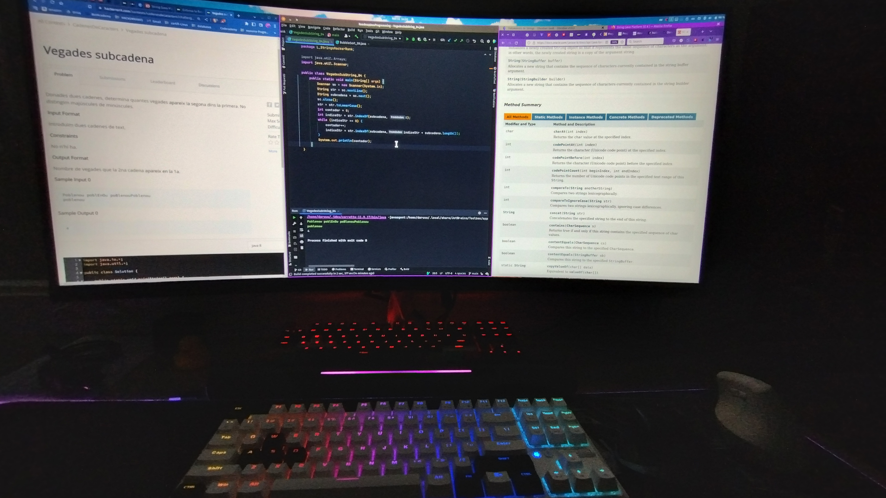

# RoadmapJavaProgramming

In this repository I'll share my programming development in the different topics of __Java__ language.
If you're interested in improve your skills you can do it too.

Inside of **directory** `src` I'll be adding the exercises that I'm doing and saved by topics.
Within each directory you can see a description of the exercises statements or a link to [HackerRank](https://www.hackerrank.com/) where you can see the different statements.
All the exercises are in __spanish__ or __catalan__.
Links of hackerRanks of differents subjects of java:

- https://www.hackerrank.com/contests/sequencials
- https://www.hackerrank.com/contests/iteratius
- https://www.hackerrank.com/contests/contest1-dades-simples-i-compostes
- https://www.hackerrank.com/contests/contest3-estructures-de-repeticio-i-salt
- https://www.hackerrank.com/contests/contest2-estructures-de-seleccio
- https://www.hackerrank.com/contests/arrays-matrius
- https://www.hackerrank.com/contests/contest2-estructures-de-seleccio
- https://www.hackerrank.com/contests/contest4-arrays
- https://www.hackerrank.com/cadenesdecaracters

